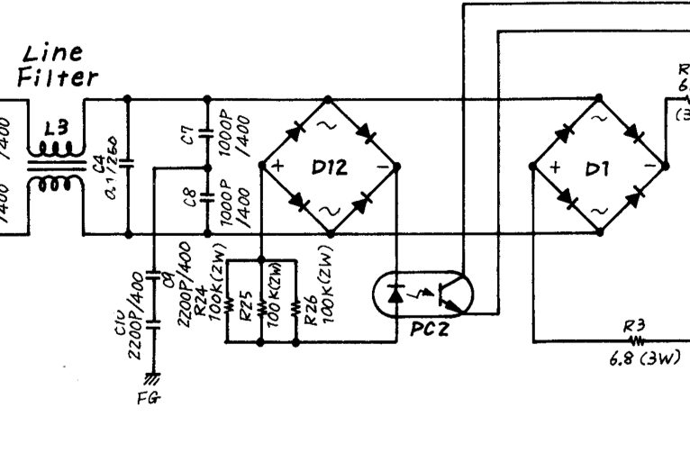
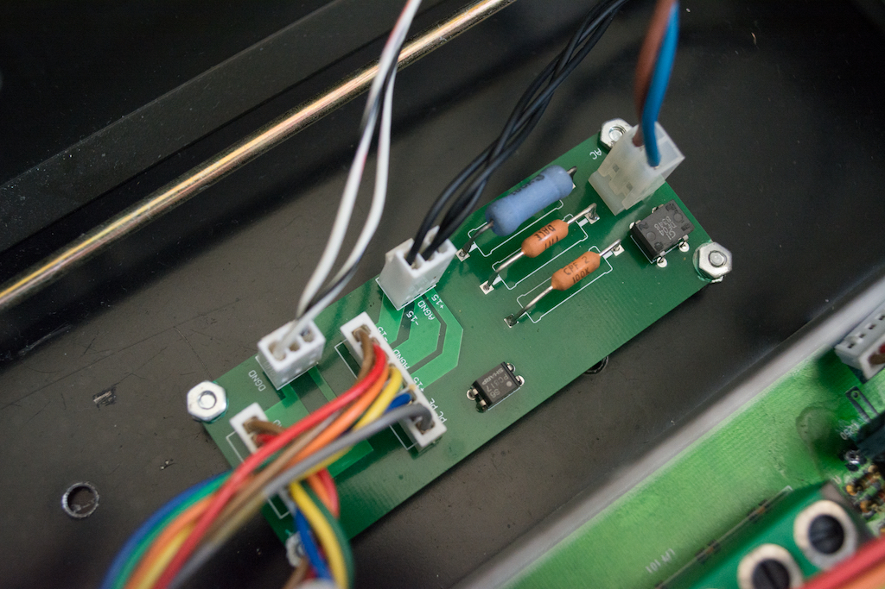

# Yamaha-PSU-mute-control

## What is it?

Allows the use on non original power supplies in older Yamaha rackmount audio devices.
 

 

The board consists of the bridge rectifier, 3 100K resistor and phototransistor shown above. When the unit is powered on this circuit provides current to the mute control ciruit on the main board which will activate the mute relays after a short delay in order to avoid any loud spikes from the audio outputs.
 

 

Most Yamaha audio gear from this era used the same power supply board, or at least the same circuit, and if you want to replace the power supply with a newer version you may need this circuit. Use at your own risk.
 

